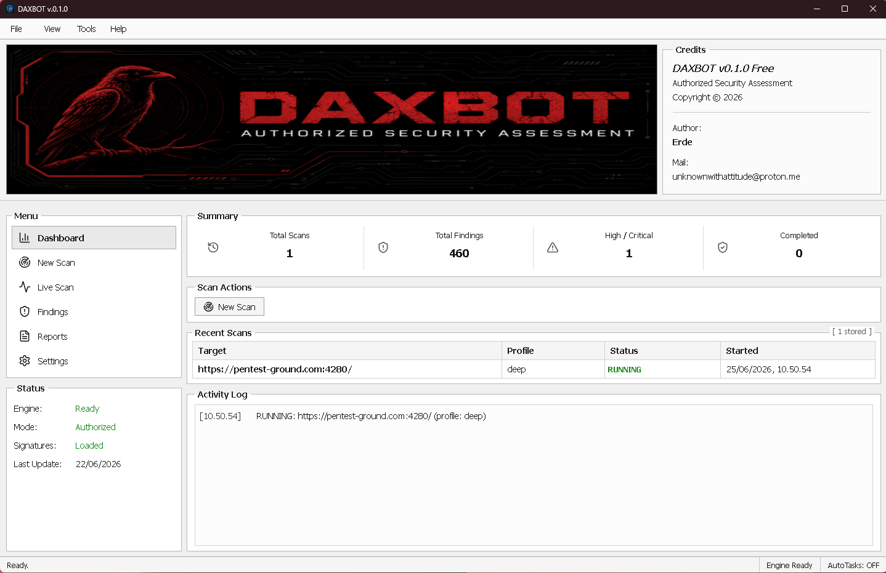

# DAXBOT v0.1.0



DAXBOT v0.1.0 is a Windows desktop application built for **Authorized Security Assessment**. It helps users scan approved websites or systems, monitor scan progress, review security findings, and understand assessment results through a simple dashboard.

DAXBOT is designed for people who want a clearer and easier way to perform security checks without relying only on command-line tools. From one interface, users can start a scan, see what is happening in real time, review detected issues, and access reports when the assessment is complete.

## What DAXBOT Does

DAXBOT helps users perform structured security assessments on targets they own or have permission to test.

It is useful for:

- Checking a website or application before release
- Finding possible security issues on an approved target
- Running internal security tests
- Monitoring scan progress in real time
- Reviewing detected findings in one place
- Preparing assessment results in a more organized way

## Main Features

- **Dashboard**  
  View scan summaries, total findings, high or critical issues, recent scans, and activity logs.

- **New Scan**  
  Create a new security scan by entering an approved target URL and selecting a scan profile.

- **Live Scan**  
  Monitor scan activity while the assessment is running.

- **Findings**  
  Review detected security issues and understand what needs attention.

- **Reports**  
  Access scan results and assessment output after the scan is completed.

- **Status Panel**  
  Check engine status, authorized mode, signature status, and last update information.

- **Signature-Based Detection**  
  Uses loaded signatures to help identify potential security issues during assessment.

- **Windows Installer**  
  Installed like normal Windows software, with installation folder selection and desktop shortcut support.

## Who Can Use DAXBOT?

DAXBOT is suitable for:

- Security researchers
- Developers
- Website owners
- Internal IT teams
- Authorized testers
- Clients who need a simple security assessment tool

## Installation

To install DAXBOT:

1. Download the setup file:

   ```text
   DAXBOT_0.1.0_x64-setup.exe
   ```

2. Run the installer.
3. Choose the installation folder.
4. Complete the setup process.
5. Open DAXBOT from the desktop shortcut or Start Menu.

## Basic Workflow

1. Open DAXBOT.
2. Select **New Scan**.
3. Enter the target URL that you are authorized to test.
4. Choose the scan profile.
5. Start the scan.
6. Monitor progress from the dashboard or **Live Scan** page.
7. Review detected issues in **Findings**.
8. Open **Reports** to view assessment output.

## Important Notice

DAXBOT must only be used for legal and authorized security testing.

Do not scan websites, servers, applications, or networks without permission. Unauthorized testing may be illegal and may violate terms of service or security policies.

The user is responsible for making sure every target has been approved before running a scan.

## Windows Security Notice

Windows may show a SmartScreen warning when opening the installer. This can happen if the application has not been code-signed yet.

If you trust the installer source and you have permission to install it, select:

```text
More info > Run anyway
```

## Uninstalling DAXBOT

DAXBOT can be removed like a normal Windows application:

1. Open Windows Settings.
2. Go to Apps.
3. Find DAXBOT.
4. Select Uninstall.

## License

DAXBOT is proprietary software. All rights reserved.

This software may not be copied, modified, redistributed, or used without permission from the owner.
